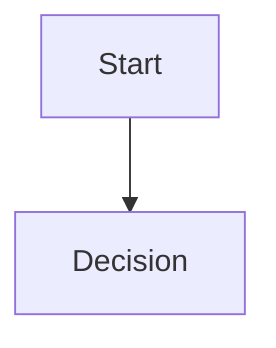

# Diagram Guidelines

## Standard

All diagrams in this repository must use Mermaid.

Mermaid is the canonical source format for diagrams because it is text-based, reviewable in pull requests, easy for AI collaborators to edit, and renderable by GitHub Markdown.

## Accepted Formats

Use one of these formats:

- Mermaid fenced code blocks inside Markdown:

````markdown

````

- Dedicated `.mmd` files when the diagram should live as a standalone source file.

## Not Accepted

Do not create repository diagrams using:

- draw.io files;
- PlantUML;
- Graphviz;
- binary-only images;
- hand-drawn SVG;
- screenshots as the only source of truth.

If a rendered image is needed for external presentation, keep the Mermaid source in the repository and treat it as canonical.

## Style Guidance

- Keep diagrams small enough to review in a pull request.
- Prefer clear labels over decorative styling.
- Place diagrams near the document or feature they explain.
- Update diagrams in the same pull request as the concept they describe.
